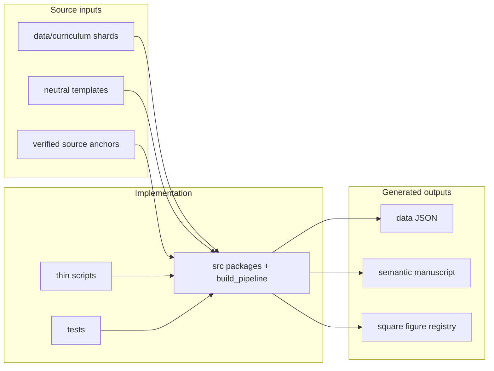

# AGEINT Project Agent Guide

AGEINT is a local active curriculum project under
`projects/active/AGEINT`. Keep it local-only unless Daniel explicitly asks
for a publication or promotion workflow and the parent repository
confidentiality checks have passed.

## System map



## Ground truth

- Runtime source spine: `data/curriculum/`.
- Optional historical guide filename: `SIST-Guide-TOC-and-Bibliography-v2.md` is recognized when present, but normal builds do not require restoring it.
- Source identity lock: `data/source_identity/` for `ageint001` through `ageint231`.
- Source-authoring surfaces: `data/curriculum/`, `manuscript/templates/*.md`,
  `src/manuscript_manifest/`, and `src/intelligence_content/`.
- Generated manuscript: `output/manuscript/`.
- Generated figures and registry: `output/figures/figure_registry.json`.
- Bibliography surfaces: `manuscript/references-*.bib` and `output/manuscript/references-*.bib`.
- Measured scope (rebuild to refresh): 16 parts, 51 chapters, 9 appendices, 57 registered figures, 172 research anchors, 296 parsed guide references.
- Build mirror artifact: `output/data/curriculum_outline.json`.

## Editing rules

- Keep scripts thin. Business logic belongs in `src/`, not in `scripts/`.
- Regenerate with `uv run python scripts/build_curriculum.py` from the AGEINT root after source-guide, source-anchor, template, figure, or renderer edits.
- Keep concrete chapter titles, visible generated section titles, counts,
  citations, paths, figures, and cross-references generated from data and
  manifest code.
- Improve generated section structure and body content in
  `src/manuscript_manifest/`, source profiles/anchors in
  `src/intelligence_content/`, or neutral templates, not in
  `output/manuscript`.
- Do not restore numbered source Markdown files under `manuscript/`; semantic generated files live only under `output/manuscript/`.
- Preserve citation keys `ageintNNN` when the numbered source identity is unchanged.
- Append new source-guide references after the locked range; do not renumber existing references.
- Use Pandoc citation keys and Pandoc-crossref labels; do not hard-code Figure, Section, or Equation numbers.
- Use label-backed section and figure prose references such as
  `[@sec:curriculum_orientation]` and `[@fig:ageint-curriculum-map]`
  rather than literal target names when pointing readers elsewhere.
- Keep all dual-use material defensive, educational, authorized, synthetic, and non-operational: no live targets, evasion recipes, exploit instructions, manipulation playbooks, covert-action procedures, or unsafe cyber-physical actions.
- Treat Perplexity as discovery or second opinion only. Final citations must point to directly verified official, standards, public-domain, or scholarly sources encoded in `src/intelligence_content/` or parsed from the guide.
- Deep-pass source lanes include accessibility/digital inclusion, procurement/vendor governance, agent incident response, AI red-team assurance, public-sector transparency, rights-impact privacy review, model card reporting, dataset documentation, algorithmic transparency reporting, records retention/auditability, secure release/change control, risk exception governance, learner support/accommodations, assurance evaluation evidence, and procurement performance monitoring.
- Generated and inserted figures should remain roughly square; the renderer normalizes PNG assets and tests enforce readable aspect-ratio bounds.
- Advisory overlays: `domain_profile.yaml` replaces the numerical `experiment_plan.yaml` pattern used by code-centric exemplars.
- Combined multi-project pytest: `[tool.template] skip_combined_pytest = true` in `pyproject.toml` because the session-scoped build fixture is expensive; the per-project 90% gate remains authoritative.
- Documentation: AGEINT uses an extended domain doc set under `docs/` plus thin hub stubs (agent_instructions, testing_philosophy, etc.) instead of numbered source manuscript chapters.

## Verification

Run the project test suite before claiming completion:

```bash
uv run pytest tests/ --cov=src --cov-fail-under=90
```

The suite includes source identity stability, source-lane metadata, generated
reader-facing section architecture, figure-registry, topic-frame routing
(`test_topic_frame_routing.py`), topic content quality caps
(`test_topic_content_quality.py`), and safety-audit checks.

Banned generic fallback phrases must stay absent from generated manuscript after rebuild:

```bash
rg "defensible claim whose meaning|treats each source topic through|parsed AGEINT source spine" output/manuscript/
```

For manuscript checks from the template repo root, also run:

```bash
uv run python -m infrastructure.validation.cli markdown projects/AGEINT/output/manuscript --repo-root .
uv run python -m infrastructure.validation.cli prerender projects/AGEINT/output/manuscript --repo-root .
```

## Package documentation

| Path | AGENTS.md |
| --- | --- |
| `src/` | [src/AGENTS.md](src/AGENTS.md) |
| `src/intelligence_content/` | [src/intelligence_content/AGENTS.md](src/intelligence_content/AGENTS.md) |
| `src/figures/` | [src/figures/AGENTS.md](src/figures/AGENTS.md) |
| `scripts/` | [scripts/AGENTS.md](scripts/AGENTS.md) |
| `tests/` | [tests/AGENTS.md](tests/AGENTS.md) |
| `docs/` | [docs/AGENTS.md](docs/AGENTS.md) |
| `data/` | [data/AGENTS.md](data/AGENTS.md) |
| `manuscript/` | [manuscript/AGENTS.md](manuscript/AGENTS.md) |
